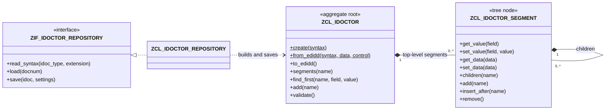

# IDoctor

IDoctor turns an SAP IDoc into an object tree. You can create an IDoc, load it from the
database, find and change its segments with typed or field-level access, check it against
the syntax of its IDoc type, and save it back.

It was built for two jobs that come up in almost every SAP integration:

- **Changing EDIDD in a user exit or BAdI.** Build the tree from the exit's data records,
  change it, and hand back an EDIDD table with SEGNUM, PSGNUM and HLEVEL renumbered.
- **Fixing IDocs in error status (e.g. 51) in bulk.** Load each IDoc, correct the faulty
  field values, save it, and reprocess it as usual.

```abap
DATA repository TYPE REF TO zif_idoctor_repository.
repository = NEW zcl_idoctor_repository( ).

DATA(idoc) = repository->load( '0000000000471100' ).
LOOP AT idoc->find_all( name  = 'E1EDKA1'
                        field = 'PARVW'
                        value = 'WE' ) INTO DATA(ship_to).
  ship_to->set_value( field = 'PARTN'
                      value = '0000004711' ).
ENDLOOP.
repository->save( idoc ).
COMMIT WORK.
```

## Contents

- [Features](#features)
- [Requirements](#requirements)
- [Installation](#installation)
- [Usage](#usage)
- [Saving IDocs](#saving-idocs)
- [Architecture](#architecture)
- [Extending IDoctor](#extending-idoctor)
- [Clean core](#clean-core)
- [Tests](#tests)
- [Messages](#messages)
- [Contributing](#contributing)
- [Credits](#credits)
- [License](#license)

## Features

- Create an empty IDoc for any basic type and extension, or build the tree from EDIDD
  records. The parent of each segment comes from the IDoc type, so SEGNUM, PSGNUM and HLEVEL
  in the input don't need to be filled.
- Produce EDIDD records again, numbered afresh.
- Navigate the tree: top-level segments, children, parent, and deep search by segment type
  and field value.
- Read and write segment data field by field (`get_value` / `set_value`) or as a whole
  structure (`get_data` / `set_data` with the DDIC structure of the segment, e.g. `E1EDP01`).
- Add, insert and remove segments. Every structural change is checked against the IDoc
  type: the parent must be right, the order of siblings is kept, and a segment can't occur
  more often than the IDoc type allows.
- Validate the whole IDoc: the minimum and maximum occurrences of every segment type under
  each parent (mandatory segments included) and the order of siblings.
- Load an IDoc by number and save changed segment contents through SAP's IDoc edit
  interface. The caller keeps the LUW.

## Requirements

- SAP_BASIS 7.50 or higher (ECC on 7.50 or any S/4HANA release). The library code uses
  only constructs available in 7.50.
- **Known limitation:** the unit tests of `ZCL_IDOCTOR_REPOSITORY` use the Function Module
  Test Double Framework (`CL_FUNCTION_TEST_ENVIRONMENT`), which exists from ABAP 7.56. On
  7.50 to 7.55, that class's test include doesn't activate. Until this is resolved, delete
  the local test classes of `ZCL_IDOCTOR_REPOSITORY` on those releases.

## Installation

Install with [abapGit](https://abapgit.org):

1. Create package `Z_IDOCTOR`.
2. Clone this repository into it, online or offline.

The folder `src/demos` becomes subpackage `Z_IDOCTOR_DEMOS` with the demo reports. Delete
that subpackage if you don't want the demos in your system.

| Object | Type | Package | Purpose |
|---|---|---|---|
| `ZCL_IDOCTOR` | Class | `Z_IDOCTOR` | The IDoc: aggregate root, owns every structural rule |
| `ZCL_IDOCTOR_SEGMENT` | Class | `Z_IDOCTOR` | A segment: tree node with typed and field access |
| `ZIF_IDOCTOR_REPOSITORY` | Interface | `Z_IDOCTOR` | Reading IDoc types and IDocs, saving IDocs |
| `ZCL_IDOCTOR_REPOSITORY` | Class | `Z_IDOCTOR` | Implementation through the SAP IDoc interface |
| `ZCX_IDOCTOR_ERROR` | Exception class | `Z_IDOCTOR` | The one exception of IDoctor |
| `ZIDOCTOR` | Message class | `Z_IDOCTOR` | All texts |
| `ZIDOCTOR_DEMO_01` … `_04` | Programs | `Z_IDOCTOR_DEMOS` | Runnable examples |

## Usage

### Change EDIDD in a user exit or BAdI

Keep the logic in a class of your own and let the exit delegate to it. Typing the EDIDD
parameter generically lets the method accept the exit's table whatever its key.

```abap
METHOD add_ship_to.        " IMPORTING control TYPE edidc  CHANGING data TYPE STANDARD TABLE
  DATA(syntax) = repository->read_syntax( idoc_type = control-idoctp
                                          extension = control-cimtyp ).
  DATA(idoc) = zcl_idoctor=>from_edidd( syntax  = syntax
                                        data    = data
                                        control = control ).

  DATA(sold_to) = idoc->find_first( name  = 'E1EDKA1'
                                    field = 'PARVW'
                                    value = 'AG' ).
  DATA(ship_to) = sold_to->insert_after( 'E1EDKA1' ).
  ship_to->set_value( field = 'PARVW'
                      value = 'WE' ).
  ship_to->set_value( field = 'PARTN'
                      value = sold_to->get_value( 'PARTN' ) ).

  data = idoc->to_edidd( ).
ENDMETHOD.
```

`read_syntax( )` reads each IDoc type once per repository instance, so keep one repository
for the whole run. Demo `ZIDOCTOR_DEMO_04` shows the complete pattern.

### Fix IDocs in error status

```abap
LOOP AT docnums INTO DATA(docnum).
  TRY.
      DATA(idoc) = repository->load( docnum ).
      LOOP AT idoc->find_all( name  = 'E1EDP19'
                              field = 'IDTNR'
                              value = 'OLD-MATERIAL' ) INTO DATA(material).
        material->set_value( field = 'IDTNR'
                             value = 'NEW-MATERIAL' ).
      ENDLOOP.
      repository->save( idoc     = idoc
                        settings = VALUE #( commit = abap_true ) ).
    CATCH zcx_idoctor_error INTO DATA(error).
      ROLLBACK WORK.
      " log error->get_text( ) and continue with the next IDoc
  ENDTRY.
ENDLOOP.
```

One IDoc is one LUW, so a failure never undoes the IDocs before it. Demo `ZIDOCTOR_DEMO_03`
adds a selection screen, a test mode and a result list.

### Build an IDoc from scratch

```abap
DATA(idoc) = zcl_idoctor=>create( repository->read_syntax( 'ORDERS05' ) ).

DATA header TYPE e1edk01.
header-curcy = 'EUR'.
idoc->add( 'E1EDK01' )->set_data( header ).

DATA(item) = idoc->add( 'E1EDP01' ).
item->set_value( field = 'MENGE'
                 value = '5' ).
item->add( 'E1EDP19' )->set_value( field = 'IDTNR'
                                   value = 'MAT-4711' ).

DATA(findings) = idoc->validate( ).   " e.g. a mandatory segment that is still missing
DATA(records) = idoc->to_edidd( ).
```

`add( )` puts a segment where the IDoc type puts it, whatever order you add segments in.

### API at a glance

| `ZCL_IDOCTOR` | |
|---|---|
| `create( syntax )` | Empty IDoc |
| `from_edidd( syntax data [control] )` | IDoc from data records |
| `to_edidd( )` | Data records, numbered afresh |
| `control( )` | Control record |
| `segments( [name] )` | Top-level segments |
| `find_first( name [field value] )` / `find_all( … )` | Deep search |
| `add( name )` | New top-level segment |
| `validate( )` | Findings against the syntax |

| `ZCL_IDOCTOR_SEGMENT` | |
|---|---|
| `name( )`, `parent( )`, `children( [name] )`, `idoc( )` | Navigation |
| `get_value( field )` / `set_value( field value )` | Field access |
| `get_data( IMPORTING data )` / `set_data( data )` | Typed access |
| `find_first( … )` / `find_all( … )` | Search below this segment |
| `add( name )` | New child segment |
| `insert_before( name )` / `insert_after( name )` | New sibling |
| `remove( )` | Removes the segment and everything below it |

| `ZIF_IDOCTOR_REPOSITORY` | |
|---|---|
| `read_syntax( idoc_type [extension] )` | Syntax of an IDoc type |
| `load( docnum )` | IDoc from the database |
| `save( idoc [settings] )` | Writes changed segment contents |

Every error is a `ZCX_IDOCTOR_ERROR` with its text in message class `ZIDOCTOR`. The T100
key says which error it is.

## Saving IDocs

`save( )` writes through the same IDoc edit interface that transaction WE02 uses
(`EDI_DOCUMENT_OPEN_FOR_EDIT`, `EDI_CHANGE_DATA_SEGMENTS`, `EDI_DOCUMENT_CLOSE_EDIT`):

- **Contents only.** Segment data can be changed. Adding, removing or moving segments of a
  stored IDoc is refused, because SAP's edit interface changes existing data records only.
  See [Extending IDoctor](#extending-idoctor) for the route to structural fixes.
- **Only what changed.** Records whose data is unchanged aren't written. Each stored record
  keeps its own SEGNUM, PSGNUM and HLEVEL.
- **SAP's edit trail.** SAP records the IDoc as edited (status 69 inbound, 32 outbound) and
  keeps the original as a separate IDoc (status 70 / 33). Reprocess edited IDocs as usual,
  e.g. with BD87.
- **The caller keeps the LUW.** `save( )` doesn't commit unless you ask for it with
  `settings-commit = abap_true`. Otherwise end the LUW with `COMMIT WORK` or
  `ROLLBACK WORK` yourself.
- **No lost updates.** The IDoc is locked while it is written. If it was changed in the
  database after you loaded it, for example by a user or a reprocessing run, nothing is
  written and you get message `ZIDOCTOR 050`. Load the IDoc again after each save.

## Architecture



IDoctor has two layers.

**The model: `ZCL_IDOCTOR` and `ZCL_IDOCTOR_SEGMENT`.** These are pure in-memory objects with
no function module calls and no `SELECT`. Tests and consumers use them directly, so they
have no interfaces of their own.

- `ZCL_IDOCTOR` is the aggregate root. It holds the syntax of the IDoc type, the control
  record and the top-level segments, and it owns every structural rule: the right parent,
  the position among siblings, the maximum number of occurrences, and the mandatory
  segments. It is `CREATE PRIVATE` and offers static creation methods.
- `ZCL_IDOCTOR_SEGMENT` is a node of the tree (composite). It reads and writes its data and
  searches below itself. It hands every structural change to its IDoc, so the root's rules
  can't be bypassed. The two classes are mutual `GLOBAL FRIENDS`, because ABAP has no package
  visibility: only the root can attach or detach nodes. There is no inheritance between them.
- The syntax (`ZCL_IDOCTOR=>TY_SYNTAX`) is plain data. In production it comes from the
  repository. In tests it is built by hand, so the model is tested without any database
  access.

**The boundary: `ZIF_IDOCTOR_REPOSITORY` and `ZCL_IDOCTOR_REPOSITORY`.** This adapter is the
only place that touches anything foreign: IDoc type definitions, IDoc tables and the LUW. It
translates SAP's structures into the model's types and classic exceptions into
`ZCX_IDOCTOR_ERROR`. Consumers depend on the interface, which lets them replace it with a
test double. They create `ZCL_IDOCTOR_REPOSITORY` once, at their entry point (report, exit,
BAdI), and pass it on as a `ZIF_IDOCTOR_REPOSITORY` reference. The class has no aliases, so
a reference typed with the class itself doesn't offer `load( )` and the other methods.

**Field layout.** The segment data (`EDIDD-SDATA`) is the DDIC structure of the segment type
moved into one character field. The repository therefore reads field positions from that
structure, which is the same layout `get_data( )` and `set_data( )` use. Typed access and
field access can never disagree.

## Extending IDoctor

The layers set the rule for every new feature:

| A new feature that… | goes into |
|---|---|
| adds a structural or content rule (e.g. allowed field values) | `ZCL_IDOCTOR`, applied in `validate( )` or in the structural methods |
| adds navigation or convenience on segments | `ZCL_IDOCTOR_SEGMENT`, delegating structural work to the root |
| reads or writes the database, or starts IDoc processing | the boundary: a method of `ZIF_IDOCTOR_REPOSITORY`, or a separate role interface implemented by the adapter once the repository would serve unrelated consumers |

Planned features and the SAP APIs they would build on:

| Feature | SAP API (Cloudification Repository state) |
|---|---|
| Status change and reprocessing | `EDI_DOCUMENT_OPEN_FOR_PROCESS`, `EDI_DOCUMENT_STATUS_SET`, `EDI_DOCUMENT_CLOSE_PROCESS`, `IDOC_START_INBOUND` (classic API) |
| Sending a new outbound IDoc | `MASTER_IDOC_DISTRIBUTE` (classic API) |
| Inbound test posting | `IDOC_WRITE_AND_START_INBOUND` (classic API) |
| Structural fixes of stored IDocs | No API changes the structure of a stored IDoc. The clean route is copy and replace: create a corrected copy (`EDI_DOCUMENT_OPEN_FOR_CREATE`, `EDI_SEGMENTS_ADD_BLOCK`, `EDI_DOCUMENT_CLOSE_CREATE`, all classic API) and close the original with a final status. |

None of these needs a change to the model, apart from setters on the control record for
outbound IDocs.

## Clean core

| Function module | Used by | State in SAP's Cloudification Repository | Clean core level |
|---|---|---|---|
| `IDOCTYPE_READ_COMPLETE` | `read_syntax( )` | classic API | B |
| `IDOC_READ_COMPLETELY` | `load( )` | classic API | B |
| `EDI_DOCUMENT_OPEN_FOR_EDIT` | `save( )` | classic API | B |
| `EDI_DOCUMENT_CLOSE_EDIT` | `save( )` | classic API | B |
| `EDI_CHANGE_DATA_SEGMENTS` | `save( )` | not classified | C |

`EDI_CHANGE_DATA_SEGMENTS` is the step of SAP's edit interface that hands over changed data
records. It isn't classified, and there is no classic API that changes the data of a stored
IDoc. A level B alternative is copy and replace (see above), which changes the IDoc number.
IDoctor never writes to IDoc tables directly, never modifies SAP objects and uses no object
that SAP marks as noAPI.

All function module calls live in `ZCL_IDOCTOR_REPOSITORY`. Field layouts and type checks
use RTTI (`CL_ABAP_TYPEDESCR`). Demo `ZIDOCTOR_DEMO_03` reads table `EDIDC` to select IDocs,
because no released CDS view exposes IDoc control records.

## Tests

Run the tests in ADT with *Run As → ABAP Unit Test* on package `Z_IDOCTOR`.

- `ZCL_IDOCTOR` and `ZCL_IDOCTOR_SEGMENT` are tested against a small IDoc type that a local
  test helper (`LTH_IDOC`) builds in memory. These tests need no database and no IDoc
  customizing.
- `ZCL_IDOCTOR_REPOSITORY` is tested with doubles of every function module it calls
  (`CL_FUNCTION_TEST_ENVIRONMENT`, ABAP 7.56+). No test reads or writes an IDoc. The tests
  use the standard ORDERS05 segments (`E1EDK01`, `E1EDP01`, `E1EDP19`), whose DDIC structures
  give the field layout.

All test classes are `RISK LEVEL HARMLESS` and `DURATION SHORT`.

## Messages

Message class `ZIDOCTOR`:

| Range | Area |
|---|---|
| 001–019 | Building and changing the tree, field and typed access |
| 020–029 | Findings of `validate( )` |
| 030–059 | Repository: reading IDoc types and IDocs, saving |
| 060–069 | Demo reports |

## Contributing

Issues and pull requests are welcome.

- Every change keeps the layers: no function module calls, `SELECT` statements or
  `COMMIT WORK` in the model.
- New code follows [Clean ABAP](https://github.com/SAP/styleguides/blob/main/clean-abap/CleanABAP.md),
  documents every public declaration with ABAP Doc, and comes with ABAP Unit tests.
- The code must activate on ABAP 7.50. [abaplint](https://abaplint.org) checks this on every
  push and pull request (`.abaplint.json`, syntax version `v750`). To run it locally:
  `npx @abaplint/cli .abaplint.json`.

## Credits

The idea of treating an IDoc as an object tree comes from Mateusz Adamus's
[IDoc-with-ABAP-OOP](https://github.com/peyn/IDoc-with-ABAP-OOP) (MIT, 2020) and his blog
post [IDoc modification made easy with ABAP Object Oriented Programming](https://community.sap.com/t5/application-development-blog-posts/idoc-modification-made-easy-with-abap-object-oriented-programming/ba-p/13477767).
IDoctor is an independent implementation and contains no code from that project.

## License

[MIT](LICENSE)
